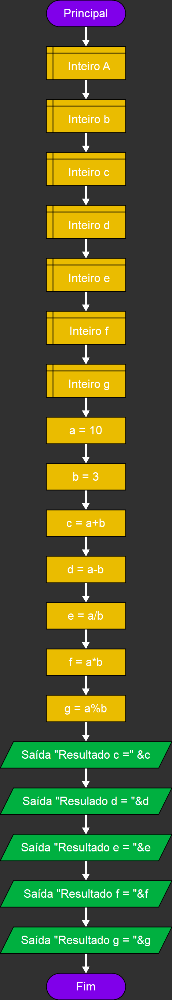

# Atividades:

## Atividade 1
Exemplos basicos de saídas

Imagem

  

## Atividade 2
Exemplos basicos de operações matematicas

Imagem

  

## Atividade 3

## Atividade 4

## Atividade 5

## Atividade 6
