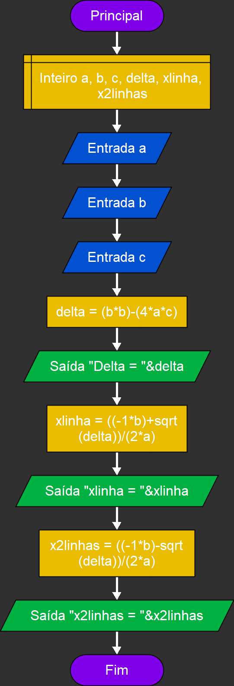
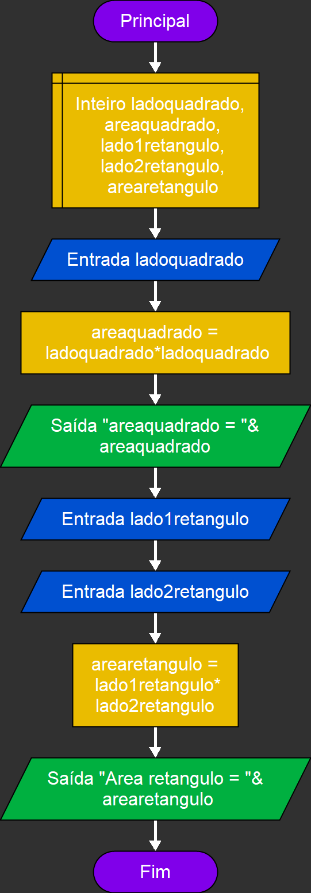
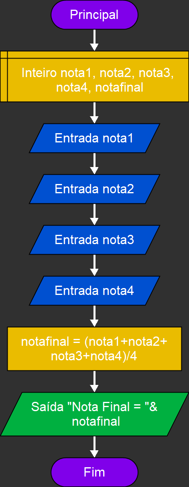

# Atividades:

## Atividade 1
Exemplos basicos de saídas

Imagem

  

## Atividade 2
Exemplos basicos de operações matematicas

Imagem

  

## Atividade 3
Exemplo basico de bhaskara

Imagem

  

## Atividade 4x
Calculo de area de quadrado,retangulo e triangulo

Imagem

  

## Atividade 5
Calculo de IMC

Imagem

  

## Atividade 6
Calculo de média 

Imagem

  

