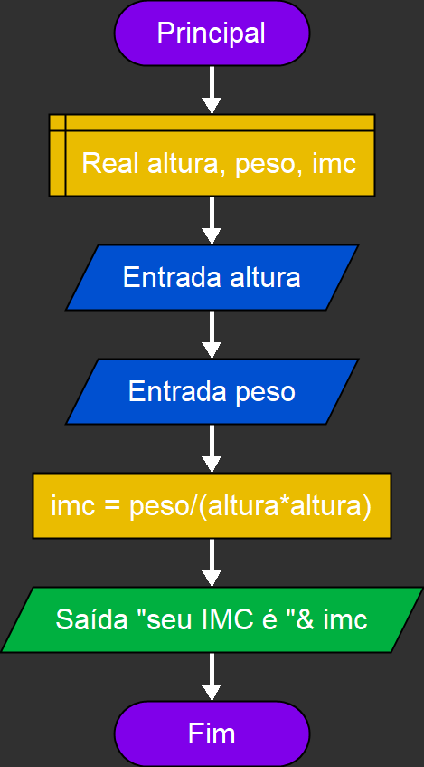

# Atividades de Algoritmos e Lógica

Este repositório contém atividades desenvolvidas no **Flowgorithm**, abordando conceitos básicos de algoritmos e lógica de programação. Cada atividade possui uma breve descrição e uma imagem ilustrativa do fluxograma correspondente.

---

## Atividade 1: Exemplos Básicos de Saídas
- **Descrição:** Demonstra exemplos básicos de saída de dados utilizando mensagens simples.
- **Objetivo:** Introduzir o conceito de exibição de mensagens no console.

Imagem

  

---

## Atividade 2: Operações Matemáticas Básicas
- **Descrição:** Realiza operações matemáticas básicas como soma, subtração, multiplicação e divisão.
- **Objetivo:** Apresentar o uso de operadores matemáticos em algoritmos.

Imagem

  

---

## Atividade 3: Cálculo de Bhaskara
- **Descrição:** Implementa o cálculo das raízes de uma equação do segundo grau utilizando a fórmula de Bhaskara.
- **Objetivo:** Trabalhar com operações matemáticas mais complexas e condições.

Imagem

  

---

## Atividade 4: Cálculo de Áreas
- **Descrição:** Calcula a área de figuras geométricas como quadrado, retângulo e triângulo.
- **Objetivo:** Aplicar fórmulas geométricas e trabalhar com entrada de dados.

Imagem

  

---

## Atividade 5: Cálculo de IMC
- **Descrição:** Calcula o Índice de Massa Corporal (IMC) com base no peso e altura fornecidos pelo usuário.
- **Objetivo:** Trabalhar com fórmulas matemáticas e exibição de resultados.

Imagem

  

---

## Atividade 6: Cálculo de Média
- **Descrição:** Calcula a média de notas fornecidas pelo usuário.
- **Objetivo:** Introduzir o conceito de médias e manipulação de múltiplos valores.

Imagem

  

